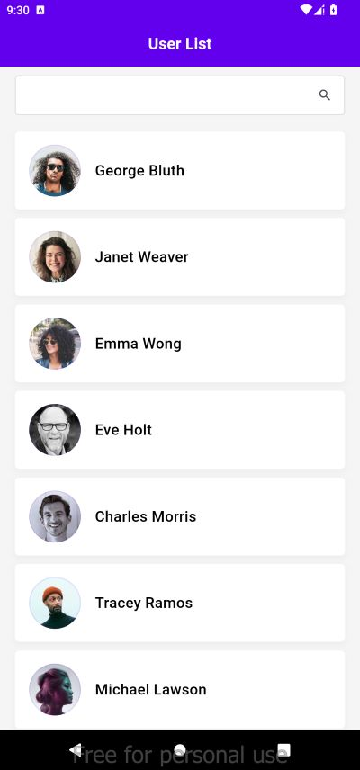
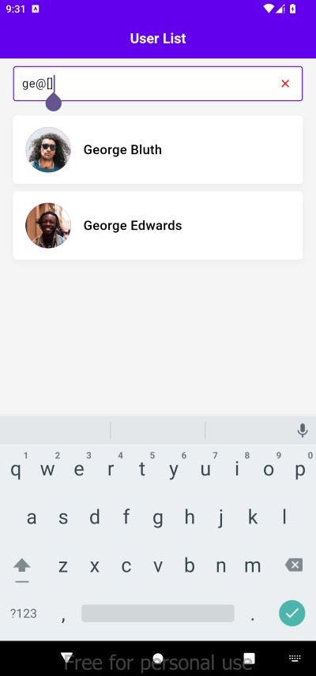
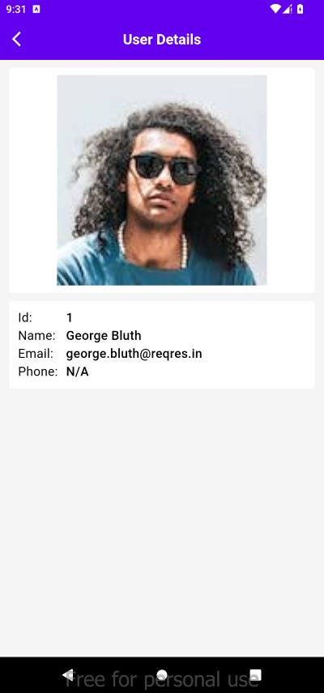

# Apptest

A new Flutter project for test.

### 📌 Prerequisites

- Flutter SDK >= 3.x
- Dart >= 3.x
- Android Studio / VSCode

### 📌 Installation    

git clone https://github.com/zaman-pallob/AppTest.git
cd AppTest
flutter run

Latest apk [Download](https://github.com/zaman-pallob/AppTest/releases/download/Release/app-release.apk)

### 📌 Features Implemented

- Pull to refresh
- Offline state data fetching from local storage
- Pagination implemented for lazy loading data
- Search functionality for searching user
- Clean Code Architecture with Provider and dependency injection implemented
- Github workflows implemented for automatic building release apk

### 📌 Business Logic
- User list fetch from https://reqres.in/api/user if the response return successfully from server app store the response on hive storage and show the user list on a listview
- When an api call is made the app will check if it has internet or not. In case of no internet app will show data from local storage
- If there is no data on the local storage there will be a snckbar shown for the root cause and a retry button will be provided for the user
- User will be able to refresh data by pulling from top
- Search by user name will  work even there are special characters in the search input

### 📸 Screenshots

  
  
  

